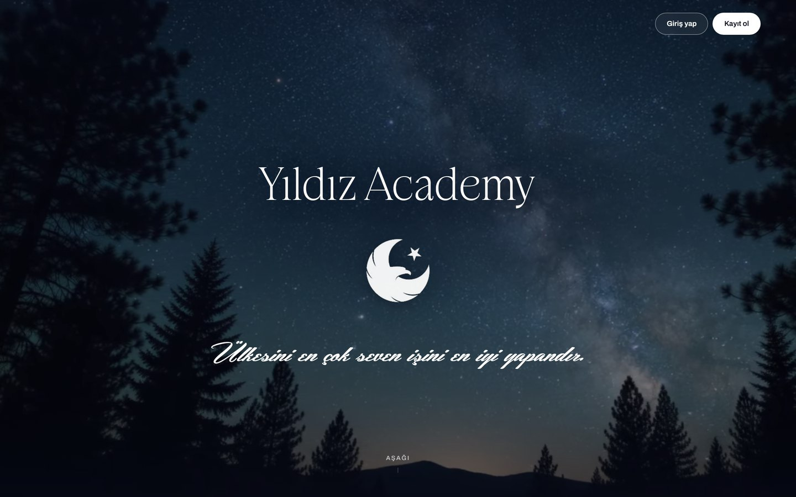
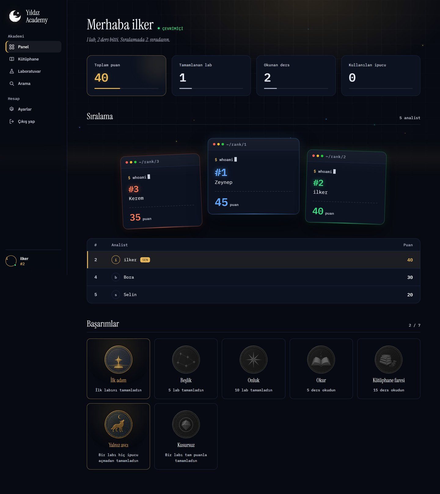
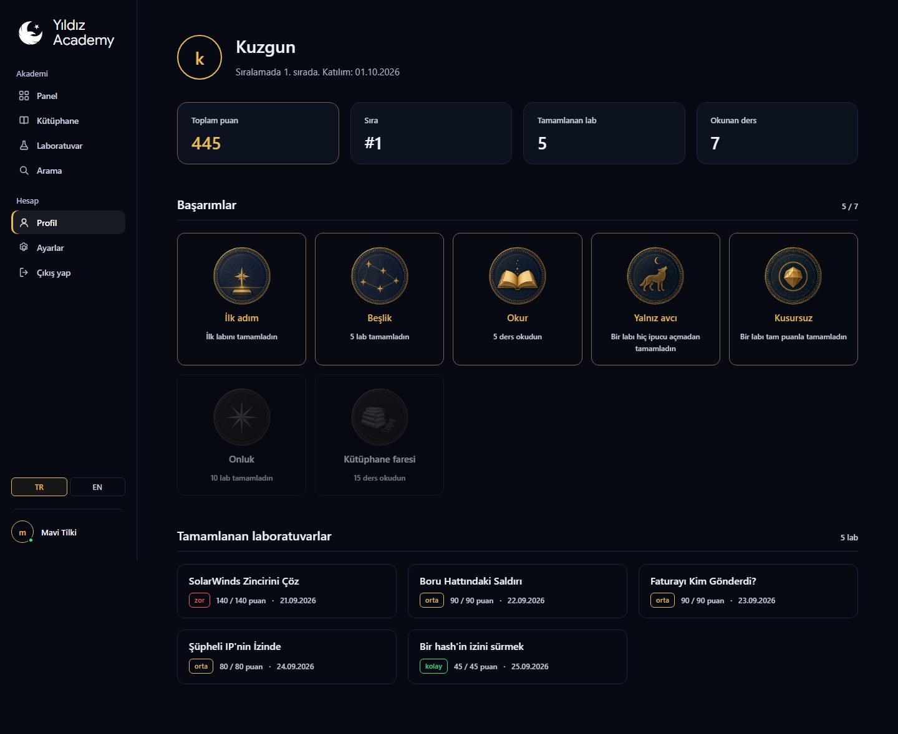

# Yıldız Academy

Siber tehdit istihbaratı öğrenmek isteyenler için kapalı bir akademi. İki yarısı
var. Kütüphanede kısa dersler duruyor; laboratuvarda ise gerçek bir iz veriliyor
(bir hash, bir onion gönderisi, bir takma ad), araştırmayı kullanıcı kendi
makinesinde yapıyor, bulduğu cevabı siteye yazıyor.

Kayıt olmadan görülebilen tek yer açılış sayfasıdır. Geri kalan her şey giriş
arkasında.



Panel kişiseldir: sayaçlar, sıralamadaki yerin ve kazanılmış mühürler. Ders ve
lab listeleri buraya değil, kendi sayfalarına ait. Görüntülerdeki isimler ve
puanlar örnek veridir.



Her kullanıcının bir profil sayfası vardır: toplam puan, sıra, başarımlar ve
tamamlanan laboratuvarlar. Sıralamadaki bir isme tıklayınca o kişinin profili
açılır. Profil adresi sıralı bir numara değil, her kullanıcıya verilen rastgele
bir kimliktir (`/profil/voVdffHgEPy8` gibi); adresler tahmin edilip tek tek
gezilemez. E-posta profilde de görünmez.



Arayüz Türkçe ve İngilizcedir. Dil sol menünün altından seçilir ve tarayıcıda
saklanır; hata mesajları ve parola sıfırlama e-postası da seçilen dilde gelir.

## Yığın

FastAPI · Jinja2 · SQLAlchemy 2 · SQLite · Argon2id · Vanilla JS

Node çalışma zamanı bağımlılığı yoktur. Giriş sonrası arayüzün renkleri ve
yazı tipleri `static/css/tokens.css` içindedir ve elle düzenlenir.
`design/tokens.json` ilk tasarımın token kaynağıdır; açılış sayfası bu setin
karşılığı olan `landing-tokens.css` üzerinde çalışır.

## Kurulum

```bash
python -m venv .venv
.venv\Scripts\activate
pip install -r requirements.txt

copy .env.example .env
python seed.py
```

`.env` içinde parola yoktur. Yönetici hesabı ayrı bir araçla açılır:

```bash
python hesap.py admin yildiz "parolan"
python hesap.py kullanici "Görünen Ad" ad@ornek.com "parolan"
python hesap.py liste
```

Parola komut satırından alınır ve hiçbir dosyaya yazılmaz, Argon2 ile hashlenip
veritabanına gider. Tek pürüz şu: komut satırına yazdığın parola kabuk
geçmişine düşer (PowerShell'de PSReadLine'ın `ConsoleHost_history.txt`
dosyası), gerekiyorsa oradan sil. Var olan bir hesabı verirsen parolası
güncellenir.

```bash
uvicorn app.main:app --reload
```

Yönetici hesabı açılmadan `/academy/admin` kapısı çalışmaz.

Uygulama açılırken veritabanı şemasını kendisi günceller: eski bir `yildiz.db`
dosyasında eksik kolon ve tablo varsa ekler, elle `ALTER TABLE` gerekmez.

## Yapı

| Yol | Ne |
|---|---|
| `app/models.py` | 13 tablo: içerik, kimlik, ilerleme |
| `app/routers/` | Sayfalar, kimlik, ders, lab, yönetim |
| `app/services/` | Cevap doğrulama, puanlama, ilerleme, sıralama, içe aktarma, e-posta |
| `app/templates/` | Jinja şablonları |
| `app/i18n.py` | Türkçe ve İngilizce arayüz metinleri |
| `hesap.py` | Yönetici ve kullanıcı hesabı açma aracı |
| `seed.py` | `content/` klasörünü veritabanına basar |
| `content/dersler/*.md` | Ders kaynakları, frontmatter + Markdown |
| `content/lablar/*.yaml` | Lab tanımları: adımlar, ipuçları, çözüm |
| `design/tokens.json` | İlk tasarımın token kaynağı |
| `static/css/tokens.css` | Giriş sonrası arayüzün renk ve yazı tipi değişkenleri |
| `static/css/base.css` | Temel katman: tipografi, düğme, form, kart |
| `static/css/app.css` | Giriş sonrası arayüz |
| `static/css/landing.css` | Açılış sayfası, kendi token seti üzerinde |
| `static/img/muhur/` | Yedi başarım rozeti; dosya adı rozetin `slug` alanıyla eşleşir |
| `static/img/lablar/` | Lab kartı görselleri; dosya adı labın `slug` alanıyla eşleşir |
| `tasarim/landing/` | Tasarım prototipleri: açılış, panel, kütüphane, laboratuvar |
| `scrollcraft/builds/` | Kaydırma anlatısı |
| `ekran/` | README görüntüleri |

Açılış sayfası ile uygulama iki ayrı CSS zinciri kullanır ve bu bilerek böyledir.
Açılış eski tasarımda kaldı, giriş sonrası sayfalar sonradan yenilendi; ikisini
tek zincire bağlamak açılışın yıldızlı görünümünü bozuyordu.

## Laboratuvar mekaniği

Bir lab çok adımlıdır; şu anki lablar 2 ile 9 adım arasında değişiyor. Her
adımın kendi sorusu, cevabı, ipuçları ve puanı vardır. Adımlar sıralıdır,
atlanamaz.

Cevap tipleri `exact`, `regex` ve `choice`. Doğrulama yalnızca sunucuda yapılır;
doğru cevap hiçbir şablona, hiçbir JSON yanıtına girmez. `regex` cevabın
tamamıyla eşleşmelidir, desenin yalnızca başı tutan cevap doğru sayılmaz.

Laboratuvar listesi önce `order_index`, sonra başlık sırasına göre dizilir.
Alan lab dosyasında isteğe bağlıdır ve varsayılanı `0`; küçük değer öne geçer,
yani bir labı listenin başına almak için ona daha küçük bir sayı vermek yeterli.
Kartta labın görseli, zorluğu, puanı, adı ve etiketleri görünür.

Adımın kazanılan puanı `max(0, puan - açılan ipuçların cezası)` ve adım ilk kez
doğru çözüldüğünde donar.

Cevap karşılaştırılırken `I`, `İ`, `ı` ve `i` tek bir harfe katlanır. Türkçe
küçültme kuralı "EICAR" yazan kullanıcıyı "eıcar" üretip yanlış cevap vermiş
duruma düşürüyordu.

## Puan kilidi

Lab her zaman sıfırlanıp baştan çözülebilir. Ama `lab_progress.solution_seen`
bayrağı sıfırlamada silinmez: çözüm metnini bir kez gören kullanıcı o labdan
bir daha puan kazanamaz. Lab tekrar çözülebilir, sıralamaya 0 yazar.

Açılan ipuçları da sıfırlamada silinmez. İpucuyla cevabı öğrenip labı
sıfırlayan kullanıcı cezadan kurtulamaz.

Sıralama, toplam puan ve başarımlar her lab için alınan en yüksek puana bakar
(`best_points`). Sonraki bir deneme daha düşük puanla biterse en yüksek puan
yerinde kalır.

## Kimlik

Görünen ad tek kamusal kimliktir ve 30 günde bir değiştirilebilir. E-posta bir
kimlik değil, bir giriş anahtarıdır: sıralamada, panelde ve kullanıcıya dönük
hiçbir yanıtta geçmez, yalnızca sahibinin ayarlar sayfasında görünür.

Giriş hatası hangi alanın yanlış olduğunu söylemez.

## Güvenlik

- Her yanıtta `X-Frame-Options: DENY`, `nosniff`, `Referrer-Policy` ve
  `frame-ancestors 'none'` içeren bir CSP gider; site başka bir sayfaya
  çerçeve olarak gömülemez.
- Başka bir siteden gelen POST istekleri (`Origin` veya `Sec-Fetch-Site`
  uyuşmazsa) reddedilir. 2 MB'tan büyük istek gövdeleri kabul edilmez.
- Giriş, kayıt, parola sıfırlama ve cevap denemeleri IP başına hız
  sınırına tabidir. IP, bağlantının kendisinden alınır; `X-Forwarded-For`
  başlığına güvenilmez. Uygulama bir ters proxy arkasında çalışacaksa
  uvicorn `--proxy-headers --forwarded-allow-ips <proxy-ip>` ile başlatılmalı,
  yoksa bütün kullanıcılar tek IP sayılır.
- Giriş sonrası `next` yönlendirmesi yalnızca site içi yollara izin verir.
- Üretimde `.env` içinde `COOKIE_SECURE=1` olmalı; çerezler yalnızca HTTPS
  üzerinden gider.

## Yönetim

`/academy/admin` ayrı bir kapıdır. Yöneticiler `admin_user` tablosunda durur,
kullanıcılarla aynı tabloyu paylaşmazlar; çerezleri de oturum süreleri de
farklıdır (yönetici 8 saat, kullanıcı 30 gün). Kodda çalışan bir varsayılan
parola yoktur.

İçerik panelden `.md` ve `.yaml` olarak yüklenir; `seed.py` ile aynı ayrıştırma
mantığından geçer.

## Parola sıfırlama

Giriş penceresindeki "Şifremi unuttum" bağlantısı e-posta adresini ister ve
o adrese tek kullanımlık bir bağlantı gönderir. Bağlantı 30 dakika geçerlidir,
veritabanında yalnızca SHA-256 özeti tutulur. Yeni parola kaydedilince
kullanıcının açık oturumları kapanır. Yanıt, adrese bağlı bir hesap olsun ya da
olmasın aynıdır; böylece kimin kayıtlı olduğu dışarıdan anlaşılmaz.

Gönderim SMTP ile yapılır, `.env.example` Resend için hazırdır; yalnızca
`SMTP_PASS` alanına Resend API anahtarı yazılır. Anahtar boşsa e-posta
gönderilmez, bağlantı sunucu günlüğüne yazılır. Alan adı doğrulanmadan Resend
yalnızca `onboarding@resend.dev` adresinden ve yalnızca Resend hesabının kendi
e-posta adresine gönderir; kendi alan adıyla `SMTP_FROM` değiştirilir.

## Fontlar

Giriş sonrası arayüz sistem yazı tipi yığınını kullanır
(`"Atlassian Sans", ui-sans-serif, -apple-system, "Segoe UI", ...`); Windows'ta
Segoe UI olarak görünür. Sol üstteki "Yıldız Academy" yazısı Google Sans'tır.
Hash ve kod gibi teknik veriler eş genişlikli yazı tipindedir.

`static/fonts/` altındaki Stokeda demo sürümü ve Hemmet yalnızca açılış
sayfasında kullanılır ve kişisel kullanım lisanslıdır. Ticari yayın kararı
verilirse lisans alınacak veya font değiştirilecek. Stokeda'nın demo sürümünde
rakamlar yoktur, her rakamın yerine üreticinin filigranı basılır; rakam
gösterecek bir yerde bu font kullanılmamalı.
